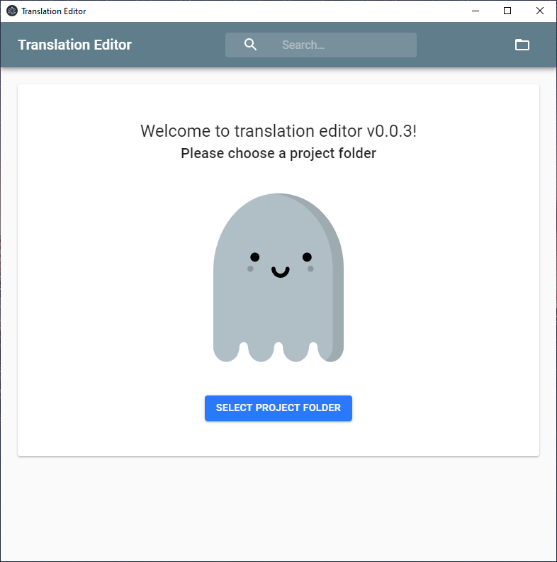
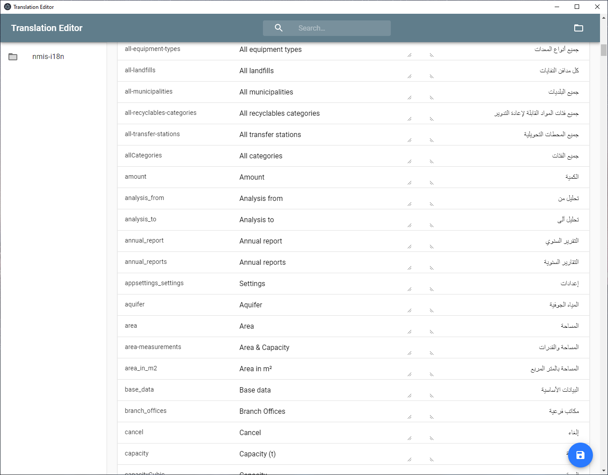

# Translation Editor
A graphical interface for dealing with json translation files.

[]

## Installation
Download the .exe or .deb file from the [release](./releases) page and install it.

**Windows users**: The installation exe is not signed. This will trigger a warning by windows which must be ignored
in order to be able to start the installation.

## Updating
The application will automatically check for updates in the background and apply them.

# Prerequisites
The editor will search inside web projects (found by `package.json` files) for a specific folder structure: `src/i18n/messages`.
This folder must contain one or multiple `.json` files named by their languages. For example `en.json` and `de.json`.

The editor will then combine the json keys and display it in a simple to use ui.

[]
